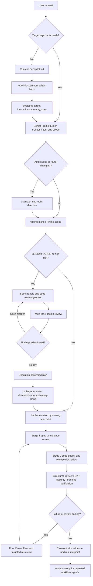

# best-copilot

English | [Simplified Chinese](README.zh-CN.md) | [Korean](README.ko.md) | [Japanese](README.ja.md)

`best-copilot` is an installable Copilot CLI agent team for serious engineering work: repository onboarding, scoped planning, spec-driven implementation, structured review, verification, and bounded workflow improvement.

It keeps `.github/**` as the canonical Copilot customization source, exposes agents and skills through `plugin.json`, and lets Codex reuse the same contract through `AGENTS.md` plus the `.codex` bridges.

The main promise is practical: large tasks should not jump from a user request straight to a patch. They should start with the **Senior Project Expert**, learn the target repository, freeze scope, pass design review, execute from an approved plan, cross-review implementation, verify with evidence, and only then close.

## Highlights

- **Installable agent team**: ship the full team as a Copilot CLI plugin instead of copying one-off instructions between repositories.
- **Senior PM orchestration**: large or risky work starts with one coordinator that owns intent, scope, planning, dispatch, fan-in, and closeout.
- **First-use repository bootstrap**: new target repositories run `/init` or `copilot init`, then get local instruction, memory, and spec scaffolds from `target-*-bootstrap` skills.
- **Spec-first delivery**: MEDIUM/LARGE work uses requirements, design, tasks, readiness review, and an execution-confirmed plan before implementation.
- **Unified review system**: `structured-review` is the single review entry for code, customization, design review, feedback intake, review handoff, and targeted re-review.
- **Fresh-context execution**: approved plans can run through `subagent-driven-development` or checkpointed `executing-plans` so tasks do not bleed context into each other.
- **Evidence-first verification**: completion claims need command output, static checks, browser evidence, or an explicit blocker.
- **Bounded evolution**: repeated failures and review loops become auditable, reversible workflow improvements rather than ad hoc prompt drift.

## Installation

Register this repository as a Copilot CLI plugin marketplace:

```bash
copilot plugin marketplace add funky-eyes/best-copilot
```

Install the plugin from the registered marketplace:

```bash
copilot plugin install best-copilot@best-copilot
```

Direct installs from repositories, URLs, or local paths are deprecated in Copilot CLI. Use the marketplace flow above for normal installs. For local development, register the local checkout as a marketplace instead:

```bash
copilot plugin marketplace add /absolute/path/to/best-copilot
copilot plugin install best-copilot@best-copilot
```

Check the installation:

```text
/agent
/skills list
```

When installed inside a target repository, the plugin contributes its agents and skills. On first substantial use, the Senior Project Expert must initialize the target repository's local facts, instructions, memory, and spec scaffolds before substantive planning or implementation so later sessions recover project state from that repository.

## First Use

Before the first meaningful task in a new repository, let Copilot learn the repository:

```text
/init
```

or run:

```bash
copilot init
```

After initialization, start substantial work with the **Senior Project Expert**. It will normalize repository facts into `.github/instructions/project.instructions.md`, create any missing local workflow scaffolds, verify those files on disk, plan the work, route specialists when needed, and keep verification explicit. If required facts or scaffolds cannot be created, the workflow should stop as `BLOCKED` instead of continuing into implementation from guesses.

## Language Policy

Every agent must first identify the user's primary language. Mixed inputs are common: a user may describe the problem in one language and paste stack traces, logs, code, or API responses in another. The primary language is the language used for the actual request or explanation, not the incidental language inside pasted evidence.

Responses should use the detected primary language unless the user explicitly asks for another language.

## Team Entry

Large tasks should start with the **Senior Project Expert**. This role is not a thin router and does not write production code directly. It behaves like the delivery lead for the engagement:

- Understand the user's intent and success criteria.
- Decide whether `/init`, bootstrapping, spec, planning, design review, or parallel work is needed.
- Freeze scope, non-goals, acceptance checks, and verification budget.
- Route work to the right specialist with frozen packets.
- Require spec/design readiness before implementation when the risk is non-trivial.
- Ensure implementation is reviewed by someone other than the author.
- Close the task only with verification evidence, residual risk, and a next resume point.

Small tasks can be handled directly by the default assistant or a specialist. If a task crosses modules, changes public contracts, touches permissions/dependencies/release surfaces, or asks for deep analysis, use the Senior Project Expert first.

## Agent Roles

| Agent | Owns | Does Not Own |
| --- | --- | --- |
| Senior Project Expert | Intent, scope, orchestration, parallel dispatch, fan-in decisions, closeout, evolution signals | Direct production implementation |
| Specification Writer | Discovery evidence, requirements/design/tasks, ADRs, progress records, memory/spec recovery | Production implementation |
| Technical Architect | Backend/full-stack design and main implementation, API/data/service boundaries, architecture review, peer review of Developer-owned code | Frontend polish, scoped parallel slices |
| Developer | Frozen implementation slices, implementation-feasibility review, peer review of Technical Architect-owned code | Architecture changes or scope expansion |
| Frontend Designer | Pages, components, interaction, responsiveness, browser behavior, visual verification | Backend mainline work |
| Quality Assurance Expert | Functional verification, regression risk, code review, merge readiness | Security review and fixes |
| Security Reviewer | Auth boundaries, sensitive data flow, dependency risk, release-surface security | General functional QA |
| Root Cause Fixer | Failure analysis, minimal patches, regression verification | Speculation-driven refactors |

## Model Strategy

The roles are not just renamed copies of one generic agent. Each agent declares an explicit model in its `.github/agents/*.agent.md` frontmatter, and the model choice matches the kind of reasoning the role needs:

| Agent | Model | Reasoning Profile |
| --- | --- | --- |
| Senior Project Expert | GPT-5.4 | Long-horizon coordination, scope control, fan-out/fan-in decisions, and closeout judgment |
| Technical Architect | GPT-5.4 | Deep backend/full-stack reasoning, public contract design, data/API boundary analysis, mainline implementation strategy, and review of Developer-owned changes |
| Specification Writer | Gemini 3.1 Pro (Preview) | Broad-context synthesis, structured requirements/design/tasks, ADRs, and recovery records |
| Developer | Gemini 3.1 Pro (Preview) | Focused execution of frozen slices, implementation-feasibility review of mainline code, fast code-context alignment, tests, and bounded verification |
| Frontend Designer | Gemini 3.1 Pro (Preview) | UI/state/context synthesis, Ant Design-style enterprise patterns, active design-system reasoning, responsive behavior, interaction quality, and browser evidence planning |
| Quality Assurance Expert | Claude Sonnet 4.6 | Low-noise review, regression reasoning, test sufficiency judgment, and merge-readiness calls |
| Security Reviewer | Gemini 3.1 Pro (Preview) | Release-surface analysis, permission boundaries, sensitive-data flow, dependency and configuration review |
| Root Cause Fixer | Claude Sonnet 4.6 | Failure triage, hypothesis pruning, minimal patch selection, and regression proof |

The routing policy is part of the product: orchestration and architecture use higher-depth planning models, implementation and specification use broad-context execution models, and QA/fix roles use concise review/debug models to keep findings actionable.

## Workflow

A big request moves through explicit gates. The exact path adapts to task size and risk, but the high-signal flow looks like this:



The important properties are:

- **Init before guessing**: repository facts come from the target repository, not chat memory.
- **Bootstraps are local to the target repo**: instructions, `memories/repo/**`, and `spec/**` are created in the target repository, not in the plugin package.
- **Review is unified**: `structured-review` handles code review, customization review, design review, feedback intake, review handoff, and targeted re-review.
- **Implementation does not self-certify**: authors do not sign off on their own files.
- **Verification is explicit**: every closeout states what was checked, what passed, and what remains risky.

## Large Task Flow

A big request does not jump from prompt to patch. It moves through visible checkpoints designed to catch bad assumptions early, force independent review before release risk escapes, and separate implementation from peer review and verification.

1. **Init**: Run `/init` or `copilot init` if repository facts are missing.
2. **Discover**: The Senior Project Expert reads minimal context and freezes target, scope, risks, and acceptance checks.
3. **Brainstorm**: If the request is ambiguous or route-changing, `brainstorming` locks the direction first so implementation does not start on the wrong semantic branch.
4. **Spec Kit**: The Specification Writer turns the locked direction into the repository's spec kit: `requirements.md`, `design.md`, and `tasks.md`.
5. **Design Review**: `spec-review-gauntlet` and `structured-review` challenge the spec kit before code starts. Technical Architect, Developer, and Quality Assurance review by default; Security Reviewer and Frontend Designer join when their surface is affected.
6. **Execution Plan**: `writing-plans` produces task boundaries, dependencies, acceptance checks, verification budget, and a current plan revision.
7. **SDD/TDD Implementation**: `subagent-driven-development` or `executing-plans` runs approved tasks through checkpointed implementation. Technical Architect owns the mainline; Developer handles non-overlapping slices; Frontend Designer handles UI. New behavior or bug fixes use test-driven development when practical.
8. **Two-Stage Review**: each task passes Stage 1 spec-compliance review before Stage 2 code-quality/release-risk review.
9. **Cross Review**: Technical Architect reviews Developer-owned changes, Developer reviews Technical Architect-owned changes, and no implementer signs off on code they authored themselves.
10. **Verify**: QA runs minimal sufficient verification; frontend work gets browser evidence; failures enter the fix loop instead of being waved through.
11. **Secure**: Security reviews release-surface, dependency, auth, and sensitive-data risks when present.
12. **Fix Loop**: Root Cause Fixer handles confirmed failures and sends them back to review or verification.
13. **Close**: Senior Project Expert summarizes changes, evidence, risks, and the next resume point.
14. **Evolve**: Repeated failures, stale triggers, review loops, or reusable lessons become auditable EvolutionEvents.

## Self-Evolution

`best-copilot` does not let agents rewrite themselves freely. Evolution is evidence-bound and reversible.

Evolution loop:

1. **Read**: task results, failed commands, review findings, user corrections, memory, and spec drift.
2. **Select**: the smallest improvement target: agent, skill, instruction, memory, README, or spec template.
3. **Propose**: an Evolution Proposal with evidence, scope, validation, and rollback.
4. **Validate**: frontmatter/schema checks, trigger evals, static checks, review, or command evidence.
5. **Write**: only accepted learning goes back to the relevant `.github/**` customization or to target-local memory/spec files created by the bootstrap skills.

Accepted improvements are recorded as `EvolutionEvent`: `signal -> target -> mutation -> validation -> rollback -> status`.

## Project Structure

```text
.
├── plugin.json
├── AGENTS.md
├── .github/
│   ├── agents/
│   ├── instructions/
│   └── skills/
├── .codex/
│   ├── agents/
│   ├── config.toml
│   ├── instructions -> ../.github/instructions
│   └── skills -> ../.github/skills
```

## Strengths

- **Higher quality by default**: major work is challenged before implementation, then checked again by cross-review and evidence-based verification instead of being rationalized after the patch already exists.
- **Spec-driven, test-driven delivery**: big work is anchored in a spec kit, and new behavior or bug fixes use tests as an execution gate instead of relying on post-hoc explanations.
- **Higher throughput with less rework**: `/init`, frozen packets, and explicit ownership reduce repeated rediscovery, cut wrong-route implementation, and keep large tasks from collapsing into one long fragile chat thread.
- **Architect/developer cross-review lanes**: the mainline owner and slice owner review each other's code so implementation does not self-certify.
- **Portable across repositories**: the workflow learns local commands, entrypoints, module boundaries, and unknowns first, so the same plugin can adapt to very different codebases without pretending they are identical.
- **Better failure handling**: failures do not get buried under optimistic summaries; they move into design review, fix loops, or verification with clear ownership and evidence.
- **Copilot-first and installable**: `.github/plugin/marketplace.json` publishes the marketplace entry, and root `plugin.json` declares agents and skills for Copilot CLI.
- **Codex-compatible**: `AGENTS.md` and `.codex` adapters reuse the same `.github` source of truth.
- **Init before execution**: official `/init` reduces blind guessing in new repositories.
- **Senior PM orchestration**: large work is scoped, reviewed, verified, and closed in phases.
- **RAG-lite memory**: Markdown index plus current workstream restore context without loading all history.
- **Spec-memory alignment**: spec owns requirements and acceptance; memory owns recovery and verified facts.
- **Lean default skills**: the default install keeps high-frequency engineering skills only.
- **Evidence-first verification**: every completion claim needs command, static check, browser evidence, or an explicit verification blocker.
- **Auditable evolution**: proven workflow lessons become reversible EvolutionEvents.

## Acknowledgements

`best-copilot` is inspired by and learns from the public ideas, workflow structures, and skill design patterns in these projects:

- [oh-my-openagent](https://github.com/code-yeongyu/oh-my-openagent): multi-agent orchestration, deep init, planning-first workflows, and session recovery.
- [Superpowers](https://github.com/obra/superpowers): composable software engineering skills such as TDD, systematic debugging, planning, review, and verification.
- [gstack](https://github.com/garrytan/gstack): Think -> Plan -> Build -> Review -> Test -> Ship -> Reflect delivery discipline.
- [UI UX Pro Max Skill](https://github.com/nextlevelbuilder/ui-ux-pro-max-skill): design-system packets and UI/UX guardrails.
- [Open Design](https://github.com/nexu-io/open-design): local-first design workflow ideas, active design systems, artifact preview, and craft-review discipline.
- [claude-mem](https://github.com/thedotmack/claude-mem): lightweight memory and cross-session recovery ideas.
- [fetch-skill](https://github.com/aresbit/fetch-skill/): source-aware fetching, output modes, and fallback fetch ladders.
- [spec-kit](https://github.com/github/spec-kit): spec-kit structure, requirements/design/tasks framing, and specification-first delivery discipline.
- [Anthropic skill-creator](https://github.com/anthropics/claude-plugins-official/tree/main/plugins/skill-creator): skill frontmatter, progressive disclosure, eval scenarios, and trigger optimization.
- [Anthropic code-simplifier](https://github.com/anthropics/claude-plugins-official/tree/main/plugins/code-simplifier): behavior-preserving simplification of recently changed code.
- [Anthropic code-review](https://github.com/anthropics/claude-plugins-official/tree/main/plugins/code-review): multi-perspective review and confidence filtering.
- [Memento-Skills](https://github.com/Memento-Teams/Memento-Skills): Read -> Execute -> Reflect -> Write learning loops.
- [Evolver](https://github.com/EvoMap/evolver): protocolized evolution, Genes/Capsules/Events, strategy presets, and auditable evolution records.
