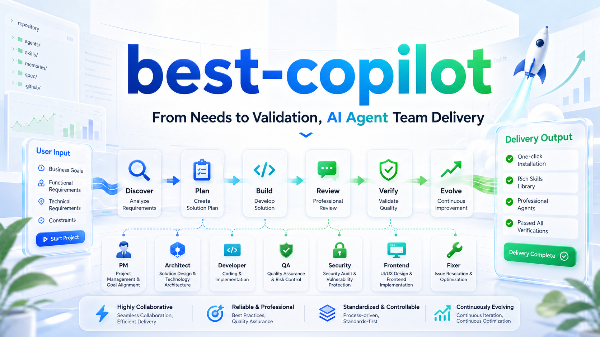

# best-copilot

[English](README.md) | 简体中文 | [Korean](README.ko.md) | [Japanese](README.ja.md)

[](plugin.json)
[](https://docs.github.com/copilot/how-tos/copilot-cli/customize-copilot)
[](agents/)
[](skills/)
[](LICENSE)



`best-copilot` 是一套可安装的 Copilot CLI agent 团队，面向严肃的工程工作。它为仓库提供一条资深交付流程：初始化事实、冻结范围、先设计再构建、通过专责角色实现、独立审查、以证据验证，并保留下次会话的恢复点。

它以 Copilot CLI 为优先。根目录下的 `agents/` 与 `skills/` 通过 `plugin.json` 暴露能力；仓库级规则保存在 `.github/instructions/**`。

## 为什么存在

大型的 AI 编码任务在从模糊的需求直接跳到补丁时常常失败。`best-copilot` 补上缺失的交付纪律：

- **一个资深入口**：由 Senior Project Expert 负责意图、范围、派发、fan-in、收口和可复用的工作流信号。
- **八位专责 agent**：规划、架构、实现、前端、QA、安全、故障修复与规格工作各自分工。
- **二十五项技能**：包含引导、搜索、规划、TDD、设计评审、执行、Java/Python 编码规约、验证、前端审计与工作流演进等可安装技能。
- **目标仓库本地的 memory 与 spec**：已安装的项目在目标仓库内保留事实、工作流、memory 与 spec，而非插件包内部。
- **证据优先的收尾**：宣称“完成”必须有命令输出、静态检查、浏览器证据，或一个明确的阻塞说明。

## 安装

把本仓库注册为 Copilot CLI 插件 marketplace：

```bash
copilot plugin marketplace add funky-eyes/best-copilot
```

从已注册的 marketplace 安装插件：

```bash
copilot plugin install best-copilot@best-copilot
```

本地开发时同样可用：

```bash
copilot plugin marketplace add /absolute/path/to/best-copilot
copilot plugin install best-copilot@best-copilot
```

当前 Copilot CLI 仍能直接从仓库安装，但 CLI 会提示直接安装已弃用，未来将仅支持 `plugin@marketplace`：

```bash
copilot plugin install funky-eyes/best-copilot
```

本地修改后请重新安装或更新插件以测试新会话，因为 Copilot CLI 会从已安装插件缓存中读取 agents 与 skills。

## 快速检查

```text
/agent
/skills list
```

预期的包结构：

```text
best-copilot
├── plugin.json
├── marketplace.json
├── agents/
│   ├── pm-coordinator.agent.md
│   ├── tech-architect.agent.md
│   ├── developer.agent.md
│   ├── frontend-designer.agent.md
│   ├── risk-qa.agent.md
│   ├── security-agent.agent.md
│   ├── auto-fixer.agent.md
│   └── spec-writer.agent.md
├── skills/
└── .github/
    ├── instructions/
    └── plugin/
```

## 工作流

```text
User request
  -> init or repo fact check
  -> Senior Project Expert freezes scope
  -> brainstorming or direct planning
  -> requirements / design / tasks when risk is non-trivial
  -> design review before implementation
  -> specialist implementation
  -> cross review
  -> QA / security / frontend verification
  -> closeout with evidence and resume point
```

对于小范围改动，流程保持精简；对于跨模块、对外契约、依赖、权限或模糊产品方向的工作，较重的门控是有意为之。

## Agent 团队

| Agent | 负责 | 不负责 |
| --- | --- | --- |
| Senior Project Expert | 意图、范围、编排、派发、fan-in、收口、演进信号 | 直接编写生产代码 |
| Specification Writer | 发现证据、requirements、design、tasks、ADR、memory/spec 恢复 | 生产实现 |
| Technical Architect | 后端/全栈设计、API/数据/服务边界、主线实现、架构评审 | 前端细节 |
| Developer | 冻结的实现切片、实现可行性评审、对架构师负责代码的实现评审 | 架构变更或范围扩展 |
| Frontend Designer | 页面、组件、交互、响应式、浏览器证据 | 后端主线 |
| Quality Assurance Expert | 功能验证、回归风险、代码审查、合并准备 | 安全专项 |
| Security Reviewer | 权限、敏感数据流、依赖、发布面安全 | 普通功能 QA |
| Root Cause Fixer | 失败诊断、最小补丁、回归验证 | 无证据的重构 |

## 技能地图

| Area | Skills |
| --- | --- |
| Bootstrap | `repo-init-scan`, `target-instructions-bootstrap`, `target-memory-bootstrap`, `target-spec-bootstrap` |
| Planning | `brainstorming`, `writing-plans`, `context-packet-fastpath`, `search-fastpath`, `spec-execution-fastpath` |
| Execution | `test-driven-development`, `executing-plans`, `subagent-driven-development`, `dispatching-parallel-agents` |
| Coding Standards | `td-java-coding-guidelines`, `td-python-coding-guidelines` |
| Review | `structured-review`, `spec-review-gauntlet`, `root-cause-investigation`, `systematic-debugging` |
| Verification | `change-verification`, `verification-before-completion`, `web-experience-audit`, `frontend-design-guardrails` |
| Evolution | `evolution-loop` |

## 首次在目标仓库中使用

在新仓库中开始有意义任务前，让 Copilot 学习项目：

```text
/init
```

或：

```bash
copilot init
```

然后由 **Senior Project Expert** 开始实质工作。该角色应将有用的仓库事实标准化到目标仓库本地文件，创建缺失的本地脚手架，并在继续实施前验证这些文件存在。

目标本地状态属于目标仓库：

```text
.github/instructions/project.instructions.md
.github/instructions/must.instructions.md
.github/instructions/skills-index.instructions.md
memories/repo/INDEX.md
memories/repo/current-workstreams.md
spec/INDEX.md
spec/templates/
```

如果必需的事实或脚手架无法创建，工作应以 `BLOCKED first_use_gate_incomplete` 停止，而不是基于猜测继续进行。

## 模型策略

每个 agent 在 `agents/*.agent.md` 中声明模型与路由策略：

| Agent | Model |
| --- | --- |
| Senior Project Expert | GPT-5.4 |
| Technical Architect | GPT-5.4 |
| Specification Writer | Gemini 3.1 Pro (Preview) |
| Developer | Gemini 3.1 Pro (Preview) |
| Frontend Designer | Gemini 3.1 Pro (Preview) |
| Quality Assurance Expert | Claude Sonnet 4.6 |
| Security Reviewer | Gemini 3.1 Pro (Preview) |
| Root Cause Fixer | Claude Sonnet 4.6 |

## 验证此包

```bash
ruby -rjson -e 'JSON.parse(File.read("plugin.json")); JSON.parse(File.read("marketplace.json")); JSON.parse(File.read(".github/plugin/marketplace.json")); puts "json ok"'
ruby -ryaml -e 'Dir["{agents,skills}/**/*.{md,agent.md}"].sort.uniq.each { |f| s=File.read(f); next unless s.start_with?("---"); YAML.safe_load(s.split("---",3)[1], permitted_classes: [Symbol]); }; puts "frontmatter ok"'
find agents -maxdepth 1 -name '*.agent.md' | sort
find skills -maxdepth 3 -name SKILL.md | sort
git diff --check
```

## 演进规则

`best-copilot` 不允许 agent 任意重写自身。工作流变更应来自已验证的信号：失败的命令、重复的 review 发现、用户修正、路由陈旧或安装/运行时偏差。

可接受的改进应当小、可回滚，并写入到拥有的表面：根目录 `agents/`、`skills/`、`.github/instructions/**`，或目标仓库本地的 memory/spec 文件。

## 致谢

`best-copilot` 借鉴并学习了若干公开的工作流与技能系统思想，例如：

- [oh-my-openagent](https://github.com/code-yeongyu/oh-my-openagent)
- [Superpowers](https://github.com/obra/superpowers)
- [gstack](https://github.com/garrytan/gstack)
- [spec-kit](https://github.com/github/spec-kit)
- [Open Design](https://github.com/nexu-io/open-design)
- [UI UX Pro Max Skill](https://github.com/nextlevelbuilder/ui-ux-pro-max-skill)
- [claude-mem](https://github.com/thedotmack/claude-mem)
- [fetch-skill](https://github.com/aresbit/fetch-skill/)
- [Memento-Skills](https://github.com/Memento-Teams/Memento-Skills)
- [Evolver](https://github.com/EvoMap/evolver)
